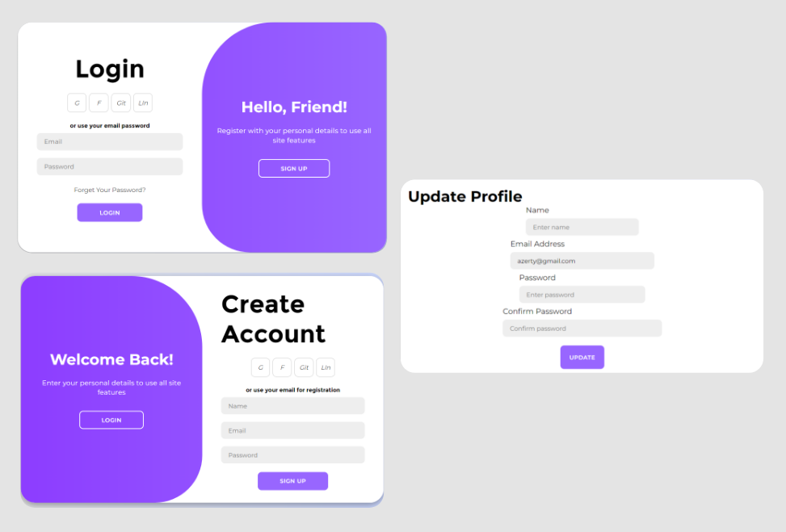

# MERN Application & Authentication with JWT

NOTE : This documentation presents an overview of the authentication (Auth) module and its associated screens.


This is an app for a MERN stack application with authentication. This is for a SPA (Single Page Application) workflow that uses the [Vite](https://vite.dev) Build tool.

auth screens :


It includes the following:

- Backend API with Express & MongoDB
- Routes for login, logout, signup, profile, settings (update profile)
- JWT authentication stored in HTTP-only cookie
- Protected routes and endpoints
- Custom middleware to check JSON web token and store in cookie
- Custom error middleware
- React frontend to register, login, logout, view profile, and update profile
- React Toastify notifications
- custom component for login and sign up design 

## Usage

- Create a MongoDB database and obtain your `MongoDB URI` - [MongoDB Atlas](https://www.mongodb.com/cloud/atlas/register)


Change the MongoDB URI with your own from atlas
Change the JWT_SECRET to what you want

### Install Dependencies (frontend & backend)

```
npm install
cd frontend
npm install
```

### Run

```

# Run frontend (:3000) & backend (:5000)
npm start

# Run backend only
npm run server
```
